# 🏋️ Zen Gym Management System

A full-stack web application to manage gym memberships, workouts, diet plans, and payments.

---

## 🚀 Features
- User registration & login system
- Membership package selection
- Online payment integration (Cashfree - Test Mode)
- Workout plan based on selected package
- BMI calculation and diet plan suggestion
- Feedback system
- Admin dashboard to manage users, packages, and payments

---

## 🛠️ Tech Stack
- Frontend: HTML, CSS, JavaScript
- Backend: PHP
- Database: MySQL
- Payment Gateway: Cashfree

---

## 📂 Project Structure
- `/cashfree` → Payment integration files  
- `/images` → Website images  
- `/screenshots` → Project screenshots  
- `.php files` → Core application logic  
- `admin.sql` & `user.sql` → Database structure  

---

## 📸 Screenshots

### 🏠 Home Page
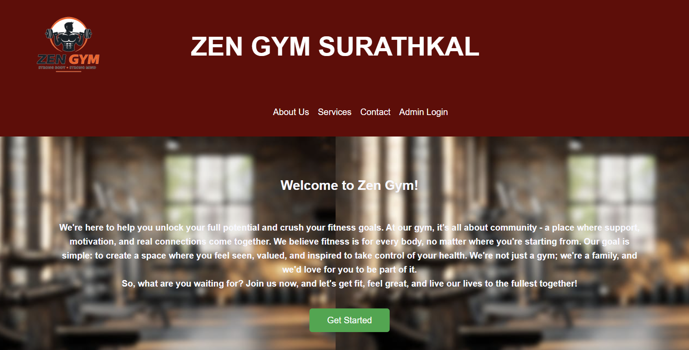

### 📝 User Registration
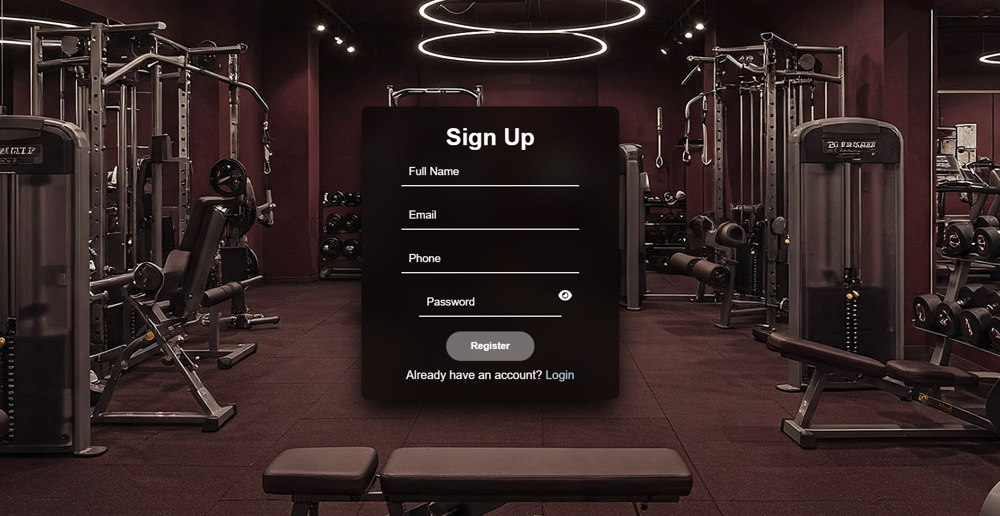

### 🔐 User Login
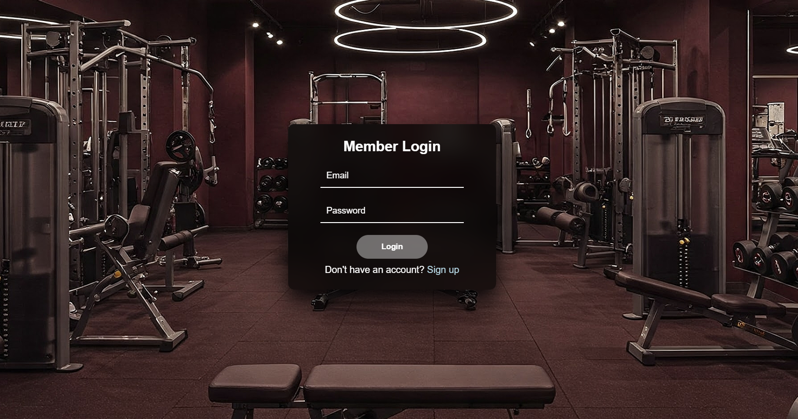

### 📦 Package Selection
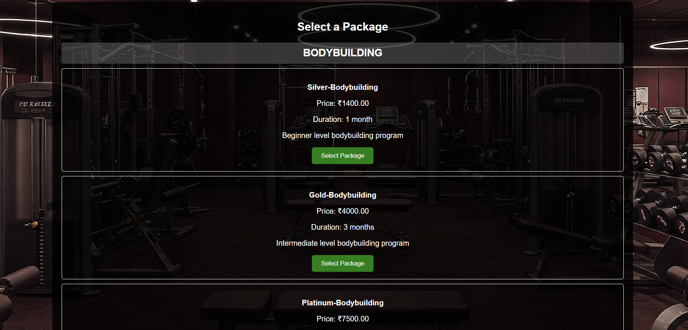

### 💳 Payment Integration
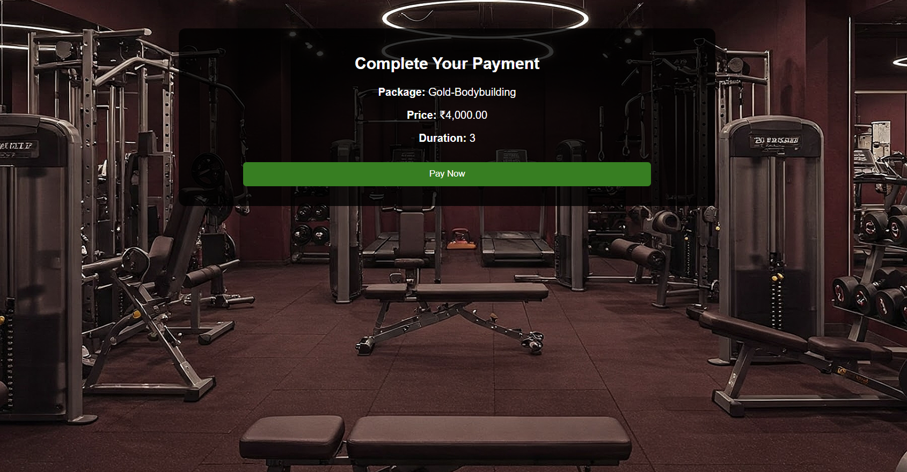

### 📊 User Dashboard
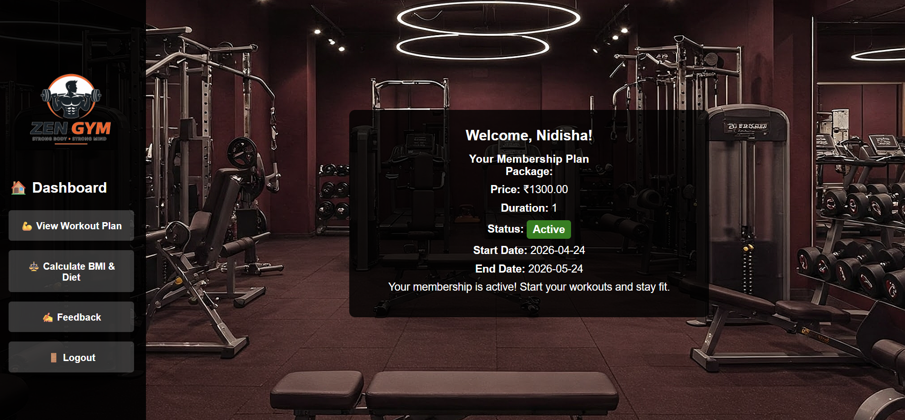

### 🏋️ Workout Plan
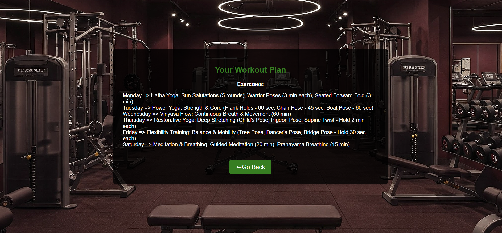

### ⚖️ BMI Calculator
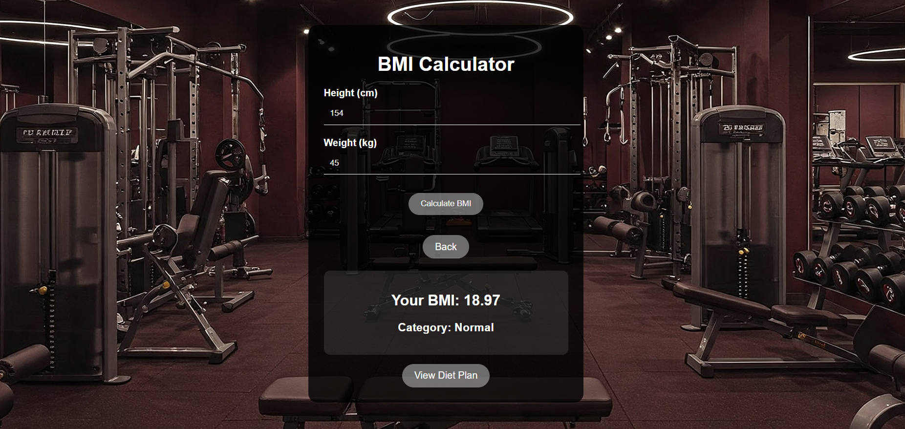

### 🥗 Diet Plan
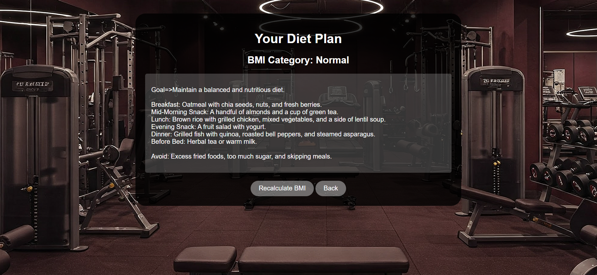

### 🔐 Admin Login
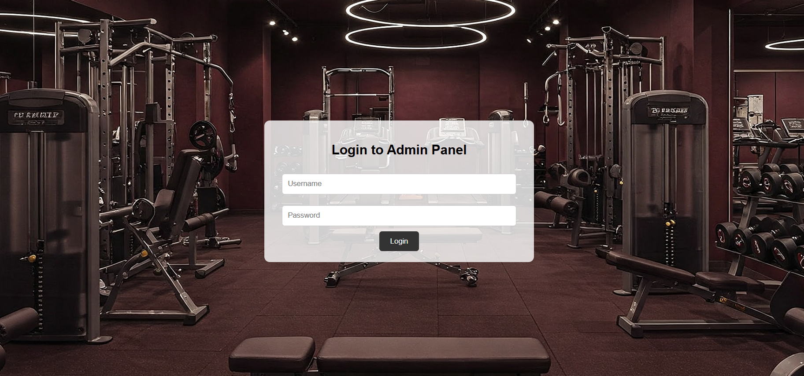

### 🛠️ Admin Dashboard
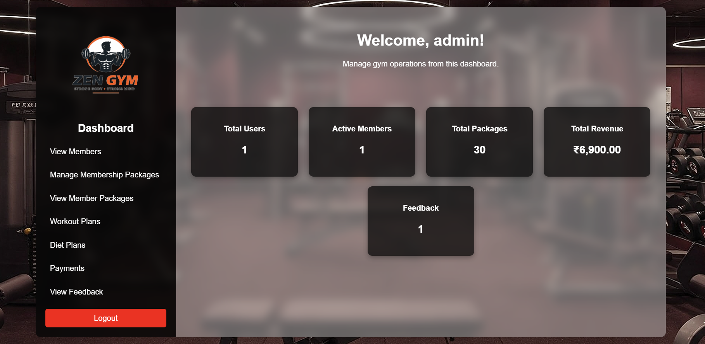

---

## ⚠️ Note
Sensitive files like database credentials and API keys are not included.

---

## 👩‍💻 Author
**Nidisha S**

---

## 👥 Contributors
This was a group project. I was primarily responsible for:
- Backend development  
- Database design  
- Payment integration (Cashfree)  

---
